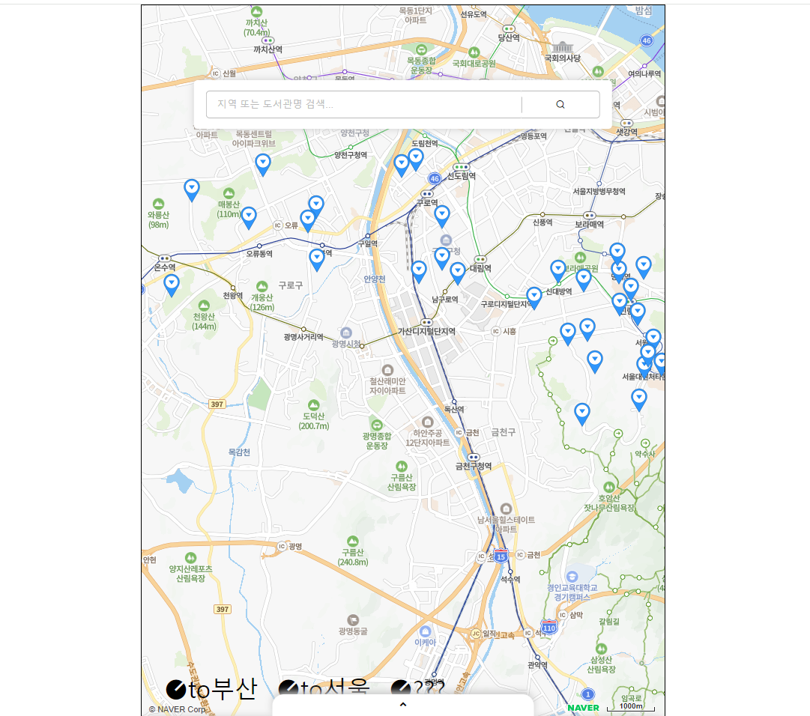

## Update Logs

- 2024.07.30
  - 검색 기능 추가
- 2023.07.29
  - naver_map_api 활용 및 마커 표시 기능 추가
  - 하단 버튼 클릭시 서울, 부산 등 미리 정의해둔 지역으로 이동 & 마커 표시

---

# readme 작성 연습

# API 활용한 지도기능 & 정보 출력

CodeLab: K-Digital Training AI 인공지능컨택센터(AICC) 웹서비스개발 3기(AICC) 프론트엔드 수업과정.

## 바로 써보기: 반응형 웹 페이지(react-map-app)으로 만나보세요!

### KR Library Map: 지도 위 도서관 찾아보기

- 해당 데모는 
- 2024년 8월 기준 페이지 개선을 위해 React 로 포팅하는 과정에 있습니다.

- 설치 없이 Web으로 곧바로 만날 수 있습니다.
- 검색을 통해 위치 확인 및 정보 열람이 가능합니다.

## 프론트 제작 과정

map 서비스는 지도 api 실습 및 api 를 통한 data 활용 실습을 위해 진행했습니다.

1. HTML 화면 구성

~ 대충 구상 내용 ~

2. CSS 화면 구성  

~ 대충 구상 내용 ~

3. JS 및 API

~ 대충 구상 내용 ~

## 데이터 설명

데이터셋은 아마.. 아래 데이터 셋임.

링크 추가..

도서관 api 데이터셋은 다음과 같이 fields 부분과 records 부분으로 구성되어있습니다.

## 참고자료
Marshallhch : https://github.com/Marshallhch/vom13_toy_projects
